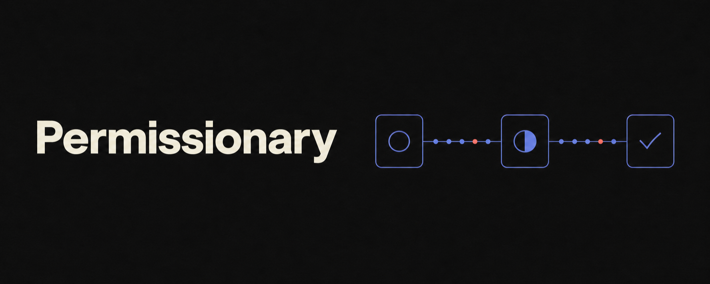

# Permissionary

## Permission state that survives prompts and Settings

Permissionary is a Swift 6, SwiftUI-first permissions library for iOS 18+. It keeps permission
state accurate before and after system prompts — and when users change access in Settings.

Read status without prompting, request access with async/await, observe typed updates, coordinate
simultaneous requests, and replace the live client with deterministic behavior in tests.

[](https://github.com/cleverClosure/Permissionary/actions/workflows/ci.yml)
[](https://github.com/cleverClosure/Permissionary/releases/latest)
[](https://swift.org)

[](LICENSE)

[Installation](#installation) · [Quick start](#quick-start) · [Capabilities](#capabilities) ·
[Demo app](#demo-app) · [Documentation](#documentation)

## Why Permissionary?

- **Stay synchronized.** The live client refreshes permission state when the app becomes active,
  so SwiftUI models reflect changes made in Settings.
- **Read without side effects.** Calling `status()` never presents a system prompt.
- **Keep prompts orderly.** Duplicate requests share one result, while requests for different
  capabilities are presented one at a time.
- **Catch configuration mistakes.** Missing usage descriptions produce actionable errors before
  the system would terminate the app.
- **Test without system prompts.** Every client operation is replaceable in tests and previews.

Permissionary manages permission state and native recovery. It does not impose a custom
permission-onboarding interface.

## Requirements

- iOS 18+
- Swift 6
- Swift Package Manager

## Installation

### Xcode

1. Choose **File → Add Package Dependencies**.
2. Enter `https://github.com/cleverClosure/Permissionary.git`.
3. Select **Exact Version** and enter `0.1.0`.
4. Add the `Permissionary` library to your app target.

### Package.swift

```swift
dependencies: [
    .package(url: "https://github.com/cleverClosure/Permissionary.git", exact: "0.1.0")
]
```

Until 1.0, minor releases may contain breaking changes, so pin an exact version.

## Quick start

```swift
import Permissionary

func enableCamera(permissions: PermissionsClient = .live) async throws {
    let status = try await permissions.camera.request()

    if status.authorization == .authorized {
        print("Camera is ready")
    }
}
```

`camera.request()` presents the system prompt only when the current state is `.notDetermined`.
Existing camera decisions are returned immediately. Denied and restricted outcomes are ordinary
states; requests throw only for exceptional conditions such as missing configuration.

Other capabilities follow their native framework semantics. In particular, Location Always can
start an upgrade request when the app currently has When In Use access.

Use `status()` whenever you only need to read the current decision. It never prompts.

## Capabilities

| Capability | Accessor | Status type |
|---|---|---|
| Camera | `camera` | `CameraStatus` |
| Microphone | `microphone` | `MicrophoneStatus` |
| Photos read/write | `photosReadWrite` | `PhotosReadWriteStatus` |
| Photos add-only | `photosAddOnly` | `PhotosAddOnlyStatus` |
| Contacts | `contacts` | `ContactsStatus` |
| Location when in use | `locationWhenInUse` | `LocationWhenInUseStatus` |
| Location always | `locationAlways` | `LocationAlwaysStatus` |
| Notifications | `notifications` | `NotificationsStatus` |
| Tracking | `tracking` | `TrackingStatus` |

## SwiftUI

Each capability has an observable model that reads its initial status, follows future updates,
and exposes explicit `refresh()` and `request()` operations.

```swift
import Permissionary
import SwiftUI

struct CameraStatusView: View {
    private let permissions: PermissionsClient
    @State private var model: CameraPermissionModel

    init(permissions: PermissionsClient = .live) {
        self.permissions = permissions
        _model = State(
            initialValue: CameraPermissionModel(permission: permissions.camera)
        )
    }

    var body: some View {
        VStack {
            Text(model.status.map { String(describing: $0.authorization) } ?? "Loading")

            Button("Enable Camera") {
                Task {
                    _ = try? await model.request()
                }
            }

            if model.status?.recovery == .openSettings {
                Button("Open Settings") {
                    Task {
                        await permissions.openSettings()
                    }
                }
            }
        }
    }
}
```

The live client re-reads every capability when the application becomes active. Models therefore
reflect Settings changes without per-view lifecycle code. Requests are never triggered by view
lifecycle.

For app-level dependency injection, `\.permissions` provides a live client by default and
accepts deterministic clients in tests and previews.

## Settings recovery

Statuses describe the recovery action your app can offer through `recovery`. Permissionary
never opens Settings on its own; your app decides whether and when to present an explicit action.
The client provides `openSettings` and `openNotificationSettings`.

When photo or contact access is limited, `manageLimitedSelection` tells your app it can present
the system selection manager. Use `limitedPhotoLibraryPicker(isPresented:)` for photos and the
system `contactAccessPicker` for contacts.

## Configuration diagnostics

Requests validate usage descriptions before presenting a prompt. A missing key produces a
descriptive `PermissionError` instead of allowing the system to terminate the process.

`PermissionsDiagnostics` can surface every configuration issue at once:

```swift
func auditPermissionConfiguration() {
    for issue in PermissionsDiagnostics.configurationIssues() {
        print(issue)
    }
}
```

| Capability | Required Info.plist key |
|---|---|
| Camera | `NSCameraUsageDescription` |
| Microphone | `NSMicrophoneUsageDescription` |
| Photos read/write | `NSPhotoLibraryUsageDescription` |
| Photos add-only | `NSPhotoLibraryAddUsageDescription` |
| Contacts | `NSContactsUsageDescription` |
| Location when in use | `NSLocationWhenInUseUsageDescription` |
| Location always | `NSLocationWhenInUseUsageDescription` and `NSLocationAlwaysAndWhenInUseUsageDescription` |
| Tracking | `NSUserTrackingUsageDescription` |
| Notifications | none |

## Prompt coordination

Coordination is automatic. Concurrent requests for the same capability coalesce into one native
prompt and one shared result. Requests for different capabilities are serialized so system
prompts do not stack.

## Observing changes

Every capability publishes a status stream. Streams never block a slow consumer; they always
deliver the latest snapshot.

```swift
func observeCamera(permissions: PermissionsClient) async {
    for await status in await permissions.camera.updates() {
        print(status.authorization)
    }
}
```

## Notification options

Notifications accept per-request options; the parameterless form requests `.standard`
(alert, sound, and badge).

```swift
func requestQuietNotifications(permissions: PermissionsClient) async throws {
    let result = try await permissions.notifications.request([.alert, .sound, .provisional])
    if result.grant == .provisional {
        print("Delivering quietly until the user promotes them.")
    }
}
```

## Testing your app

Every operation on the client is a value, so a test overrides exactly what it needs:

```swift
func makeStubClient() -> PermissionsClient {
    var permissions = PermissionsClient.live
    permissions.camera = CameraPermission(
        status: { CameraStatus(authorization: .authorized, recovery: nil) },
        request: { CameraStatus(authorization: .authorized, recovery: nil) },
        updates: { AsyncStream { $0.finish() } }
    )
    return permissions
}
```

For fully hermetic tests, construct the whole client from stubs through
`PermissionsClient.init` instead of starting from `.live`.

## Behavior guarantees

- A status read never presents a prompt.
- Denied, restricted, limited, and unavailable outcomes are states, not errors.
- Typed statuses preserve framework-specific detail, such as location accuracy and notification
  channel settings, while `PermissionAuthorization` supports generic UI.
- Recovery is descriptive and application-controlled; the library never opens Settings by itself.
- Unknown future native states map safely instead of breaking exhaustive integrations.
- The library uses Swift 6 strict concurrency without `@unchecked Sendable`.

## Demo app

`Examples/PermissionaryDemo` exercises all nine capabilities through the public SwiftUI models
and environment injection. Its coordination lab demonstrates request coalescing and prompt
serialization, and the app serves as the manual verification harness for physical devices.

## Quality

CI runs strict formatting checks, tests the package on an iOS Simulator, builds the demo app, and
compiles DocC with warnings treated as errors. It also compiles mirror copies of the README
examples, catching public API changes that make those examples invalid.

## Privacy

Permissionary has no third-party dependencies, collects no data, and uses no required-reason APIs.
It includes a privacy manifest (`PrivacyInfo.xcprivacy`) declaring that behavior.

## Documentation

- [Project scope](Docs/PROJECT.md)
- [API design](Docs/API.md)
- [Permission matrix](Docs/PERMISSION_MATRIX.md)
- [Architecture](Docs/ARCHITECTURE.md)
- [Testing strategy](Docs/TESTING.md)
- [Changelog](CHANGELOG.md)

## Project status

All nine capabilities are implemented and covered by automated tests plus manual device
verification. The public API is not yet stable; before 1.0, breaking changes may occur in any
minor release.

## Contributing

Contributions and issue reports are welcome. See [CONTRIBUTING.md](CONTRIBUTING.md) before opening
a pull request.

If Permissionary prevents a permission bug in your app, consider starring the repository so other
Swift developers can find it.

## License

Permissionary is available under the MIT license. See [LICENSE](LICENSE).
